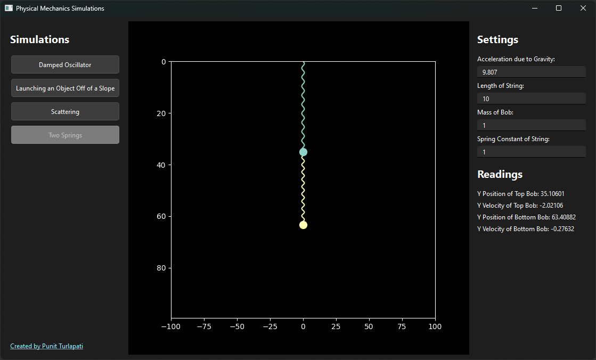

# Physical Mechanics Simulations

<p align="center">
  
</p>

As my honours project for my physical mechanics class (Physics 3201) at Missouri S&T, I created a few simulations of problems from homework and class. There are four simulations:

- A damped pendulum
- Trajectory of an object thrown off of a sloped surface
- Scattering of two hard-surface spheres
- Movement of two objects of the same mass connected by two springs

## Running the program

1. Clone the repository
2. Install the required packages using `pyproject.toml`
3. Run `main.py`

```bash
python main.py
```

The active simulation can be changed using the list of button on the left. The right contains editable parameters for the simulation, as well as live readings of positions and velocities of objects in the simulation.
